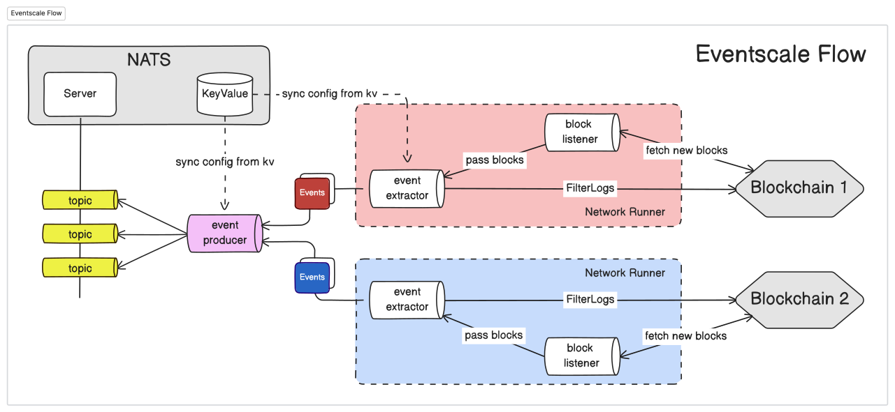

# Eventscale
Blockchain Events, Simply Scaled

## Abstract
Eventscale is a service for extracting and streaming blockchain events from EVM-based blockchains.

  

## Roadmap
Check out our [Roadmap](ROADMAP.md) for more upcoming features and enhancements.
